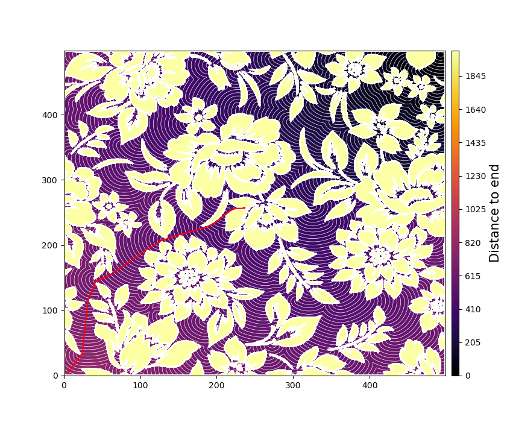

# Maze-shortest-paths-solver

This repository contains functions for finding the shortest path from one point to another in a binary image. The problem is set up so that white regions in the input image are traversable, while black are not. There are two main algorithms deployed for solving this problem. The first algorithm computes a "distance field," the distance from all points to an "end-point." The second finds a path from any point to the end-point by performing gradient ascent on the distance field. Certain regions are prohibited to cross, making most shortest paths curved.

## Algorithm


1. `EikonalSolver.find_distance_field()` in `maze_solving.py` first asks the user for a start and end-point. It iteratively solves the Eikonal equation on the traversable (white) pixels of the image, producing a distance field T. Pixels in T are updated such that the magnitude of the local gradient of T at pixel x equals 1/F(x). F is generally set equal 1 everywhere but `EikonalSolver` can be parametrized with user-defined F field too. The minimum point of the final distance field is located at the end-point, and it increases in all directions away from the end-point. This field can thus be used to find a path leading from any point to the end-point.
2. `PathFinder.find_path()` in `maze_solving.py` initializes a path at the start point. It steps forward for `N_steps` iterations. At each step, we add a point to the path by moving in the direction of the local gradient `mu`. If the proposed point enters the set of prohibited pixels, we rotate the step vector `v` until it is back in the set of allowed pixels.

## Usage
See `test.py` and docstrings in python files.
### GPU Acceleration
Typically, both stages of the algorithm can be computationlly-intensive. I made use of pytorch to process tensors on the GPU, although the program can run on CPU as well. This can be done by setting `use_gpu=True` as long as pytorch, cudatoolkit, and cudnn are installed!

python
```
eikonal_solver = EikonalSolver(img_path, 2500,
                                   use_gpu=False)  # setting use_gpu=True led to a ~20x speedup on some images. 
```

## Results
In the following figures the colorization indicates the distance from each pixel to the end-point, i.e. the distance field T. Darker indicates lower values. The contour plot of T is shown to highlight how the local gradient changes direction.

### Maze solving




*Fig. I found that sharp kinks or singularities in the image can interfere with the path-finding algorithm. In the above image, the path fails to make it to the end-point. This is because the wavefront "bled through" the thin layer of prohibited pixels of the flower petals. If this occurs, your image may be too noisy and you may try increasing the resolution and/or dilating the prohibited region using binary operations. I don't have a good solution for this yet.*

### Varying F (wave speed) field


*Fig. These figures are from a separate experiment where an entire set of pixels is used as the seed for the eikonal solver, and there are no prohibited zones. They can not be reproduced with the current version of the code, which asks the user only for a start and end point (the end-point becomes the seed). Changing the speed field F causes the gradient of the distance field to change in such a way that the eikonal equation is satisfied. When F=1 everywhere, the gradient magnitude equals 1 everywhere. Where F is higher, the gradient magnitude is lower, and vice versa. The top two figures use an satellite image of islands plus a few uniformly distributed points as the seed points. The bottom two images use only the islands as seed points.*

## Python Dependencies
- pytorch
- numba
- numpy
- matplotlib
- PIL
